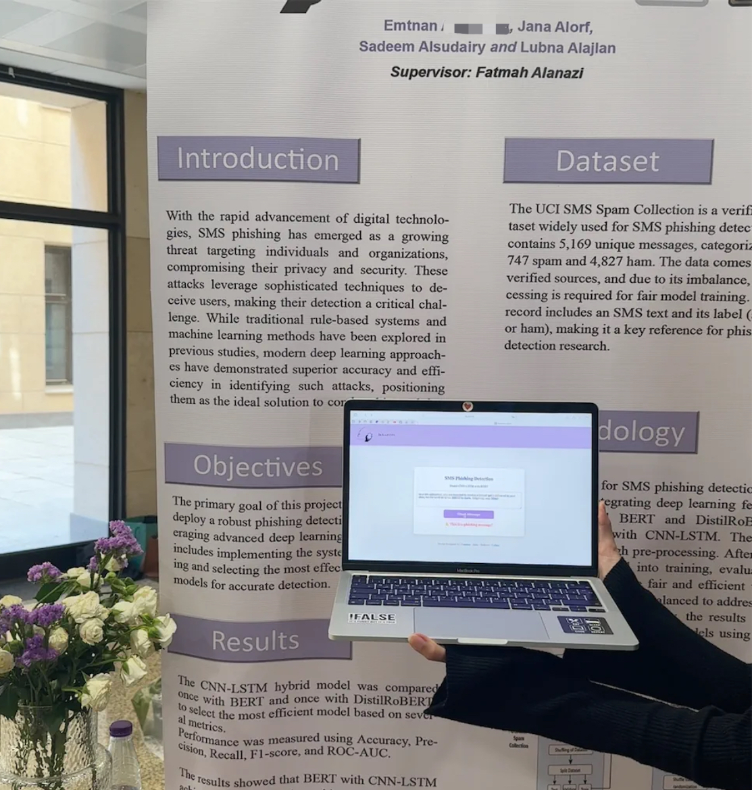

# DefendSMS 

## SMS Phishing Detection with CNN-LSTM and BERT


## Project Overview
This project aims to develop an advanced **SMS Phishing Detection Model** leveraging **deep learning** techniques, specifically **CNN-LSTM** architecture combined with **BERT (Bidirectional Encoder Representations from Transformers)** and **DistilRoBERTa**. The goal is to classify SMS messages as either **phishing (spam) or legitimate (ham)**, providing users with protection against fraudulent text messages.

## Features
- **Hybrid Model:** Combines CNN and LSTM layers with BERT/DistilRoBERTa embeddings for superior text classification.
- **Data Preprocessing:** Includes text cleaning, tokenization, and data balancing using text augmentation techniques.
- **Model Training & Evaluation:** Implements metrics such as accuracy, precision, recall, F1-score, confusion matrix, and ROC curves.
- **Web Interface:** Developed using **React.js (Next.js)** to allow users to check if a message is phishing or not.
- **Flask Backend API:** Handles model inference and interacts with the frontend.
- **Google Colab Integration:** Training and testing were performed using **Google Colab** with GPU support.

## Dataset
The dataset used in this project is [SMS Spam Collection Dataset](https://www.kaggle.com/datasets/uciml/sms-spam-collection-dataset), containing labeled messages categorized as "spam" or "ham." The dataset undergoes the following preprocessing steps:
- Removal of **null values and duplicates**.
- Conversion of messages to **lowercase**.
- **Data balancing** through **text augmentation** (using synonym replacement from NLTK's WordNet).
- Splitting into **training (80%), validation (10%), and testing (10%)** sets.

## Model Architecture
We developed two models:

1. **CNN-LSTM with DistilRoBERTa**
2. **CNN-LSTM with BERT**

Each model consists of:
- **BERT/DistilRoBERTa Tokenization & Embeddings**
- **CNN Layer:** Captures local dependencies in text.
- **Bidirectional LSTM Layer:** Captures sequential dependencies.
- **Fully Connected Layer:** Outputs final classification.
- **Sigmoid Activation Function:** Converts output to probability scores.

## Training Process
- **Optimizer:** AdamW with a learning rate of **1e-5**.
- **Loss Function:** Binary Cross-Entropy Loss (**BCELoss**).
- **Batch Size:** 32.
- **Epochs:** 10.
- **Validation and Testing:** Models were evaluated on a separate dataset to ensure robustness.

## Performance Metrics
After training, the models were evaluated using:
- **Accuracy**
- **Precision**
- **Recall**
- **F1-Score**
- **Confusion Matrix**
- **ROC-AUC Curve**

| Model | Accuracy | Precision | Recall | F1-Score |
|--------|-----------|-----------|---------|-----------|
| CNN-LSTM (DistilRoBERTa) | **98.2%** | **96.5%** | **97.8%** | **97.1%** |
| CNN-LSTM (BERT) | **98.7%** | **97.2%** | **98.3%** | **97.7%** |

## Web Application (Next.js Frontend + Flask API)
The **React.js (Next.js) Web Interface** allows users to input an SMS message and determine whether it is phishing or safe.

### Frontend Features
- **User-friendly interface** with a clean design.
- **Real-time message classification** using the trained model.
- **Result visualization:** Displays whether a message is **safe or phishing**.

### Backend API (Flask)
- **Handles prediction requests** from the frontend.
- **Loads the trained CNN-LSTM (BERT) model** and processes incoming messages.
- **Runs on port 5001** and accepts JSON requests containing the text message.

## Setup and Deployment

1. **Train the model on Google Colab**, save the trained weights [cnn_lstm_model_bert.pth](https://bit.ly/4aYLEca), and download them.
2. **Configure the Flask API (****`app.py`****)**:
   - Install dependencies:
     ```bash
     pip install flask torch transformers flask-cors
     ```
   - Run the API:
     ```bash
     python app.py
     ```
3. **Run the Next.js Frontend (****`index.js`****)**:
   - Navigate to the frontend directory.
   - Install dependencies:
     ```bash
     npm install
     ```
   - Start the development server:
     ```bash
     npm run dev
     ```
4. **Test the web application** by entering sample messages.
## Team Members
- Emtnan Alomireni
- Jana Alorf
- Sadeem Alsudairy
- Lubna Alajlan

## Presentation Link
For more details, check out our presentation: [DefendSMS Presentation](https://bit.ly/DefendSMS)

## Future Enhancements
- **Fine-tuning transformer models further** for even better accuracy.
- **Deploying the model to a cloud-based service** for scalability.
- **Building a mobile app (React Native)** to enable SMS scanning on mobile devices.
- **Integrating the system with email detection** for multi-channel phishing prevention.



